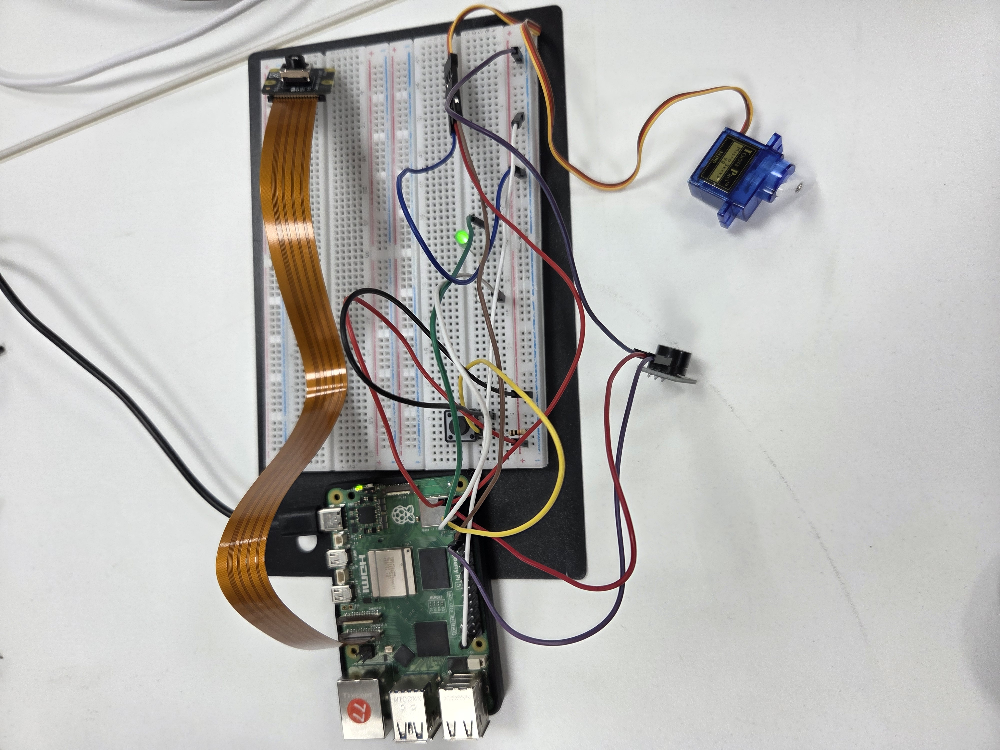

# ota-firmware-update

PC에서 라즈베리파이를 거쳐 STM32까지 펌웨어를 원격으로 전송하고 업데이트하는
OTA 시스템이다. 3명이 함께 진행했고, 그중 PC와 STM32 사이에서 중계를 담당하는
라즈베리파이 파트를 맡았다. PC로부터 펌웨어를 받아 검증하고, 이를 다시 STM32로
넘기는 과정을 구현했다.

## 데모



라즈베리파이5와 브레드보드 위 회로를 연결한 구성. 펌웨어 전송이 끝나면
서보모터와 부저로 동작을 확인할 수 있게 했다.

## 시스템 구성

```
PC (서버)  --- TCP ---  라즈베리파이  --- SPI ---  STM32
```

라즈베리파이는 PC와는 네트워크 기반의 TCP로, STM32와는 보드 간 직접 연결인
SPI로 통신한다. 같은 펌웨어 데이터지만 두 구간의 특성이 달라, 각 구간에 맞게
다뤄야 했다.

## 개발 환경

- 플랫폼: 라즈베리파이 (Linux)
- 언어: C
- 통신: TCP 소켓, SPI (spidev)
- GPIO 제어: lgpio

## 파일 구조

```
include/   tcp_client.h  spi_master.h  gpio_trigger.h
src/       tcp_client.c  spi_master.c  gpio_trigger.c  main.c
```

main이 전체 흐름을 관리하고, 통신(tcp_client), 전송(spi_master),
신호 처리(gpio_trigger)를 기능별로 나눴다.

## 동작 흐름

1. PC 서버에서 펌웨어를 TCP로 수신하고 무결성을 검증한다.
2. 검증이 끝나면 GPIO로 STM32에 인터럽트를 보내 펌웨어 수신을 준비시킨다.
3. STM32의 준비 완료 신호를 확인한 뒤, SPI로 펌웨어를 전송한다.

main.c는 이 과정을 반복하며, 각 단계에서 실패하면 잠시 후 다시 시도한다.

## 구현

### TCP 수신과 부분 수신 처리

PC가 보낸 펌웨어를 TCP로 받는데, 처음에는 recv를 한 번 호출해 받으려 했다.
그런데 TCP는 요청한 크기만큼 보내도 데이터가 여러 번에 나뉘어 도착할 수
있어, 한 번만 받으면 펌웨어의 일부만 받고 끝나는 문제가 있었다.

그래서 받아야 할 크기를 미리 정해두고, 그만큼 다 받을 때까지 recv를 반복하는
방식으로 바꿨다. 헤더로 파일 크기를 먼저 받은 뒤, 그 크기를 다 채울 때까지
수신을 이어간다.

### 무결성 검증

수신한 펌웨어가 전송 도중 손상되지 않았는지 확인하기 위해, 헤더로 함께 받은
해시와 실제 받은 파일의 해시를 비교한다. 해시는 리눅스 sha256sum으로 구한다.
일치하면 PC에 OK를 보내고 다음 단계로 넘어가고, 일치하지 않으면 FAIL을 보내
파일을 버리고 다시 받는다. 검증 결과를 서버에 보고해 전 과정이 추적되도록 했다.

### SPI 패킷 전송

STM32로 펌웨어를 보낼 때는 받는 쪽의 제약을 먼저 고려해야 했다. STM32가 한
번에 받을 수 있는 수신 버퍼 용량이 정해져 있어, 그보다 큰 데이터를 한꺼번에
보내면 받지 못하고 유실될 수 있었다.

그래서 STM 담당자와 버퍼 크기를 확인해 펌웨어를 256바이트씩 나누고, 각 조각
앞에 1바이트 헤더를 붙여 257바이트 패킷으로 전송했다. 헤더 값으로 일반 펌웨어
데이터(0x00)인지 마지막 검증용 데이터(0x01)인지를 구분한다. 전송이 끝나면
CRC32 값을 보내 STM32가 받은 데이터가 온전한지 한 번 더 확인하게 했다.

### BUSY 흐름 제어

라즈베리파이가 SPI로 보내는 속도를 STM32가 따라오지 못해, 처리 중인 데이터가
덮어써지며 유실되는 문제가 있었다.

이를 STM32의 BUSY 신호로 해결했다. STM32가 데이터를 처리하는 동안 BUSY 핀을
HIGH로 올리는데, 라즈베리파이는 패킷을 보내기 전 이 핀을 확인한다. BUSY가
HIGH면 LOW로 내려갈 때까지 대기했다가, 준비가 된 뒤에 다음 패킷을 보낸다.
서로 다른 두 장치의 처리 속도 차이를 신호로 맞춘 것이다.

### GPIO 핸드셰이크

펌웨어를 받을 준비가 안 된 STM32에 무작정 데이터를 보내면 안 되므로, 전송
전에 신호를 주고받는다. 라즈베리파이가 인터럽트 신호를 보내 STM32를 깨우고,
STM32가 준비를 마치면 보내는 준비 완료 신호를 기다린다. 정해진 시간(10초)
안에 신호가 오지 않으면 타임아웃으로 처리해 무한정 대기하지 않도록 했다.
